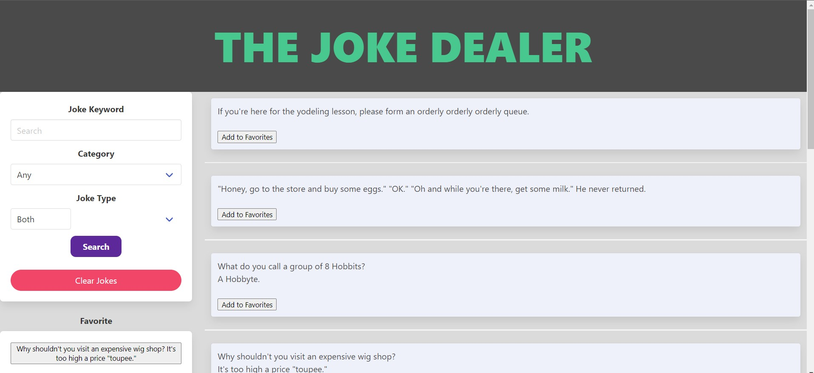

# The Joke Dealer
Need to lighten the room up? I got the joke for you! Jokes are safe for work!

## Description

Practice web application to practice the use of more Web API's.

In this web application. You can search and or pick categories of jokes your i the mood for and have them displaued to the side.  Like the joke your seeing?  Click the add to favorites button and save them for later.  These jokes are running in safe mode which makes it fun for everyone!

## Usage

Provide instructions and examples for use. Include screenshots as needed.

To add a screenshot, create an `assets/images` folder in your repository and upload your screenshot to it. Then, using the relative file path, add it to your README using the following syntax:

## Credits
https://jquery.com/

https://bulma.io/

https://jokeapi.dev/